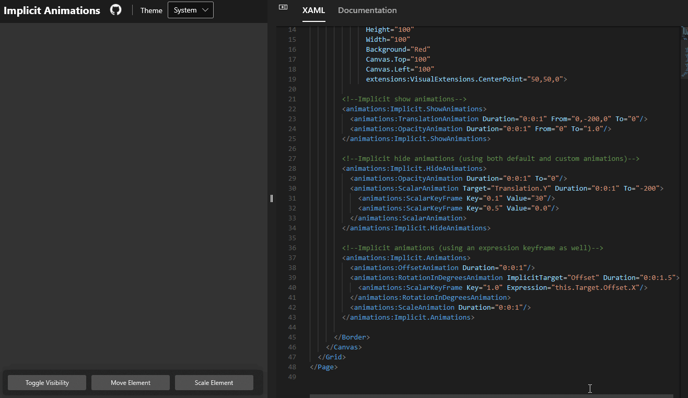

# ImplicitAnimationSet

The [`ImplicitAnimationSet`](https://docs.microsoft.com/dotnet/api/microsoft.toolkit.uwp.ui.animations.ImplicitAnimationSet) type is the equivalent of [`AnimationSet`](https://docs.microsoft.com/dotnet/api/microsoft.toolkit.uwp.ui.animations.AnimationSet) in the context of implicit [Composition animations](https://docs.microsoft.com/windows/uwp/composition/composition-animation). It represents a set of implicit animations that can only run on the [Composition layer](https://docs.microsoft.com/windows/uwp/composition/visual-layer) and that are available in three categories: show, hide, and implicit animations. `ImplicitAnimationSet` restricts the type of contained animations to objects implementing the [`IImplicitTimeline`](https://docs.microsoft.com/dotnet/api/microsoft.toolkit.uwp.ui.animations.IImplicitTimeline) interface to offer an additional level of build-time safety when constructing animations from XAML. Similar to the other interfaces used for explicit animations this architecture is also extensible in that users can also easily plug in their custom types implementing this interface into an `ImplicitAnimationSet` collection.

> **Platform APIs:** [`ImplicitAnimationSet`](https://docs.microsoft.com/dotnet/api/microsoft.toolkit.uwp.ui.animations.ImplicitAnimationSet), [`AnimationSet`](https://docs.microsoft.com/dotnet/api/microsoft.toolkit.uwp.ui.animations.AnimationSet), [`IImplicitTimeline`](https://docs.microsoft.com/dotnet/api/microsoft.toolkit.uwp.ui.animations.IImplicitTimeline), [`Implicit`](https://docs.microsoft.com/dotnet/api/microsoft.toolkit.uwp.ui.animations.Implicit)

## How it works

The `ImplicitAnimationSet` is mostly used implicitly when attaching implicit animations through the `Implicit` class, that exposes attached properties to set implicit animations to UI elements. As mentioned above, implicit composition animations can be set to trigger either when an element is shown or hidden, or whenever one of the targeted properties changes. This makes it very easy to create animations that dynamically react to changes in the visual state of UI elements, making it possible to nicely transition between different positions or layouts.

Here is an example that shows how different animations can be attached to a UI element using the `Implicit` class:

```xml
<!--Implicit show animations-->
<animations:Implicit.ShowAnimations>
  <animations:TranslationAnimation Duration="0:0:1" From="0,-200,0" To="0"/>
  <animations:OpacityAnimation Duration="0:0:1" From="0" To="1.0"/>
</animations:Implicit.ShowAnimations>

<!--Implicit hide animations (using both default and custom animations)-->
<animations:Implicit.HideAnimations>
  <animations:OpacityAnimation Duration="0:0:1" To="0"/>
  <animations:ScalarAnimation Target="Translation.Y" Duration="0:0:1" To="-200">
    <animations:ScalarKeyFrame Key="0.1" Value="30"/>
    <animations:ScalarKeyFrame Key="0.5" Value="0.0"/>
  </animations:ScalarAnimation>
</animations:Implicit.HideAnimations>

<!--Implicit animations (using an expression keyframe as well).
    These animations can also bind to other properties as triggers: in this
    example we are animating the rotation whenever the Offset changes.-->
<animations:Implicit.Animations>
  <animations:OffsetAnimation Duration="0:0:1"/>
  <animations:RotationInDegreesAnimation ImplicitTarget="Offset" Duration="0:0:1.5">
    <animations:ScalarKeyFrame Key="1.0" Expression="this.Target.Offset.X"/>
  </animations:RotationInDegreesAnimation>
  <animations:ScaleAnimation Duration="0:0:1"/>
</animations:Implicit.Animations>
```

This code results in the following, when tested in one of the sample pages in the Toolkit sample app:



## Examples

You can find more examples in the [sample app](https://github.com/windows-toolkit/WindowsCommunityToolkit/tree/master/Microsoft.Toolkit.Uwp.SampleApp).
