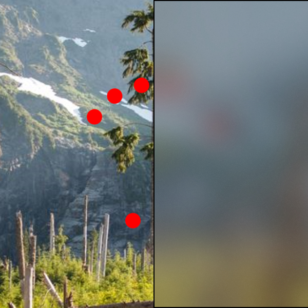

# AcrylicBrush

The [AcrylicBrush](https://docs.microsoft.com/dotnet/api/microsoft.toolkit.uwp.ui.media.acrylicbrush) is a [Brush](https://docs.microsoft.com/uwp/api/windows.ui.xaml.media.brush) that implements an acrylic effect with customizable parameters.

> [!div class="nextstepaction"]
> [Try it in the sample app](uwpct://Brushes?sample=AcrylicBrush)

## Syntax

```xml
<Border BorderBrush="Black" BorderThickness="1" VerticalAlignment="Center" HorizontalAlignment="Center" Width="400" Height="400">
  <Border.Background>
    <media:AcrylicBrush
        BackgroundSource="Backdrop"
        TintColor="DimGray"
        TintOpacity="0.25"
        BlurAmount="20"
        TextureUri="ms-appx:///Assets/BrushAssets/NoiseTexture.png"/>
  </Border.Background>
</Border>
```

## Example Image



## Properties

| Property | Type | Description |
| -- | -- | -- |
| BackgroundSource | AcrylicBackgroundSource | The background source mode for the effect. |
| BlurAmount | double | The blur amount for the effect (ignored when using HostBackdrop source). |
| TintColor | Color | The tint for the effect. |
| TintOpacity | double | The tint opacity factor for the effect. |
| TextureUri | Uri | The `Uri` for the texture to use. |

## Code behind support

This brush can be also be built from code behind through the `PipelineBuilder` class.

```csharp
Brush brush = PipelineBuilder.FromBackdropAcrylic(
    Colors.DimGray,
    0.25f,
    20,
    "/Assets/BrushAssets/NoiseTexture.png".ToAppxUri()).AsBrush();
```

## Sample Project

[AcrylicBrush sample page Source](https://github.com/Microsoft/WindowsCommunityToolkit//tree/master/Microsoft.Toolkit.Uwp.SampleApp/SamplePages/AcrylicBrush). You can [see this in action](uwpct://Brushes?sample=AcrylicBrush) in the [Windows Community Toolkit Sample App](http://aka.ms/uwptoolkitapp).

## Requirements

| Device family | Universal, 10.0.17134.0 or higher |
| --- | --- |
| Namespace | Microsoft.Toolkit.Uwp.UI.Media |
| NuGet package | [Microsoft.Toolkit.Uwp.UI.Media](https://www.nuget.org/packages/Microsoft.Toolkit.Uwp.UI.Media/) |

## API

* [AcrylicBrush source code](https://github.com/windows-toolkit/WindowsCommunityToolkit/blob/master/Microsoft.Toolkit.Uwp.UI.Media/Brushes/AcrylicBrush.cs)
* [PipelineBuilder source code](https://github.com/windows-toolkit/WindowsCommunityToolkit/blob/master/Microsoft.Toolkit.Uwp.UI.Media/Pipelines/PipelineBuilder.cs)

## Related Topics

* [Win2D GaussianBlurEffect reference](http://microsoft.github.io/Win2D/html/T_Microsoft_Graphics_Canvas_Effects_GaussianBlurEffect.htm)
* [XamlCompositionBrushBase Examples](https://docs.microsoft.com/uwp/api/windows.ui.xaml.media.xamlcompositionbrushbase#examples)
