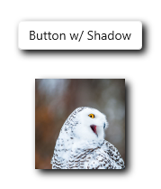
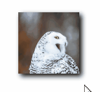

# Attached Shadows

Attached Shadows allow you to more easily create beautiful shadow effects within your app with little to no modification of the visual tree required, unlike our previous [`DropShadowPanel`](../controls/DropShadowPanel.md) control.

> **Platform APIs:** [`AttachedCardShadow`](/dotnet/api/microsoft.toolkit.uwp.ui.media.attachedcardshadow), [`AttachedDropShadow`](/dotnet/api/microsoft.toolkit.uwp.ui.attacheddropshadow)

## Introduction

There are two types of attached shadows available today, the `AttachedCardShadow` and the `AttachedDropShadow`. It is recommended to use the `AttachedCardShadow` where possible, if you don't mind the dependency on Win2D. The `AttachedCardShadow` provides an easier to use experience that is more performant and easier to apply across an entire set of elements, assuming those elements are rounded-rectangular in shape. Whereas, the `AttachedDropShadow` provides masking support and can be leveraged in any UWP app without adding an extra dependency.

### Capability Comparison

The following table outlines the various capabilities of each shadow type in addition to comparing to the previous `DropShadowPanel` implementation:

| Capability                    | AttachedCardShadow                                                 | AttachedDropShadow                                              | DropShadowPanel (deprecated)                                                              |
|-------------------------------|--------------------------------------------------------------------|-----------------------------------------------------------------|-----------------------------------------------------------------------------------------|
| Dependency/NuGet Package      | 🟡 Win2D via<br>`Microsoft.Toolkit.Uwp.UI.Media`                       | ✅ UWP Only (Composition Effect)<br>`Microsoft.Toolkit.Uwp.UI`  | ✅ UWP Only (Composition Effect)<br>`Microsoft.Toolkit.Uwp.UI`                              |
| Layer                         | Inline Composition +<br>Win2D Clip Geometry                           | Composition via<br>Target Element Backdrop                         | Composition via<br>`ContentControl` Container                                                |
| Modify Visual Tree            | ✅ No                                                              | 🟡 Usually requires single target element, even for multiple shadows    | ❌ Individually wrap each element needing shadow                                         |
| Extra Visual Tree Depth       | ✅ 0                                                               | 🟡 1 per sibling element to cast one or more shadows to          | ❌ _**4** per Shadowed Element_                                                                |
| Masking/Geometry              | 🟡 Rectangular/Rounded-Rectangles only                               | ✅ Can mask images, text, and shapes (performance penalty)     | ✅ Can mask images, text, and shapes (performance penalty)                                 |
| Performance                   | ✅ Fast, applies rectangular clipped geometry                       | 🟡 Slower, especially when masking (default);<br>can use rounded-rectangles optimization                  | ❌ Slowest, no optimization for rounded-rectangles                                                     |
| ResourceDictionary Support    | ✅ Yes                                                              | ✅ Yes                                                           | ❌ Limited, via complete custom control style +<br>still need to wrap each element to apply |
| Usable in Styles              | ✅ Yes, anywhere, including app-level                               | 🟡 Yes, but limited in scope due to element target | ❌ No                                                                                    |
| Supports Transparent Elements | ✅ Yes, shadow is clipped and not visible                           | ❌ No, shadow shows through transparent element                  | ❌ No, shadow shows through transparent element                                          |
| Animation Support             | ✅ Yes, in XAML via [`AnimationSet`](../animations/AnimationSet.md) | 🟡 Partial, translating/moving element may desync shadow         | ❌ No                                                                                    |

## AttachedCardShadow (Win2D)

The `AttachedCardShadow` is the easiest to use and most performant shadow. It is recommended to use it where possible, if taking a Win2D dependency is not a concern. It's only drawbacks are the extra dependency required and that it only supports rectangular and rounded-rectangular geometries (as described in the table above).

> [!div class="nextstepaction"]
> [Try it in the sample app](uwpct://controls?sample=attachedcardshadow%20%28win2d%29)

The great benefit to the `AttachedCardShadow` is that no extra surface or element is required to add the shadow. This reduces the complexity required on development and allows shadows to easily be added at any point in the development process. It also supports elements which are transparent without seeing the shadow behind them!

### Example

The example shows how easy it is to not only apply an `AttachedCardShadow` to an element, but use it in a style to apply to multiple elements as well:

```xaml
    xmlns:ui="using:Microsoft.Toolkit.Uwp.UI"
    xmlns:media="using:Microsoft.Toolkit.Uwp.UI.Media"/>

    <Page.Resources>
        <media:AttachedCardShadow x:Key="CommonShadow" Offset="4"/>

        <Style TargetType="Button" BasedOn="{StaticResource DefaultButtonStyle}">
            <Setter Property="ui:Effects.Shadow" Value="{StaticResource CommonShadow}"/>
            <Setter Property="HorizontalAlignment" Value="Center"/>
        </Style>
    </Page.Resources>

    <StackPanel Spacing="32" VerticalAlignment="Center">
        <Button Content="I Have a Shadow!"/>
        <Image ui:Effects.Shadow="{StaticResource CommonShadow}"
               Height="100" Width="100"
               Source="ms-appx:///Assets/Photos/Owl.jpg"/>
    </StackPanel>
```

### Example Output



## AttachedDropShadow (Composition)

The `AttachedDropShadow` provides masking support to a wide variety of elements including transparent images, shapes, and text. Masking to a custom shape that's not rectangular or rounded-rectangular is the main scenario where an `AttachedDropShadow` will be useful. Unlike it's predecessor, the [`DropShadowPanel`](../Controls/DropShadowPanel.md), the `AttachedDropShadow` doesn't need to wrap the element being shadowed; however, it does require another element to cast the shadow on to.

This makes it a bit more complex to use than the `AttachedCardShadow` and the `DropShadowPanel`, but since multiple `AttachedDropShadow` elements can share the same surface, this makes it much more performant than its predecessor.

> [!div class="nextstepaction"]
> [Try it in the sample app](uwpct://controls?sample=attacheddropshadow%20%28composition%29)

### Remarks

While `DropShadowPanel` encapsulated the complexities of adding a shadow, it added a lot of depth and complexity to the visual tree. `AttachedDropShadow` instead requires that you provide the surface where the shadows should be cast, such as a common backdrop element. This means that each shadow can use the same shared surface rather than creating its own backdrop element for each shadow (like `DropShadowPanel` did). This slight trade-off for ease-of-use is gained in performance. However, it does mean it may not be as flexible for certain use cases with manipulation of an element. In those cases we recommend to try and use `AttachedCardShadow` instead or wrapping an element and its backdrop in a custom control.

### Example

The following example shows how to use an `AttachedDropShadow` as a resource with a `TextBlock` to mask the shadow of some text:

```xaml
    <Page.Resources>
        <ui:AttachedDropShadow x:Key="CommonShadow" Offset="4" CastTo="{x:Bind ShadowTarget}"/>
    </Page.Resources>

    <Grid>
        <Border x:Name="ShadowTarget"/>
        <TextBlock ui:Effects.Shadow="{StaticResource CommonShadow}"
                   Text="This is some text with a Shadow!"
                   HorizontalAlignment="Center"/>
    </Grid>
```

### Example Output


## Animation

Either type of Attached Shadow can be easily animated using the Toolkit's [`AnimationSet`](../animations/AnimationSet.md) api. These provide an easy XAML based way to animate a wide variety of elements, including a variety of shadow properties. They can also be animated with any other composition animation technique in code-behind as well using either the [`AnimationBuilder`](../animations/AnimationBuilder.md) or built-in composition animations.

> **Platform APIs:** [`BlurRadiusDropShadowAnimation`](/dotnet.api/microsoft.toolkit.uwp.ui.animations.blurradiusdropshadowanimation), [`ColorDropShadowAnimation`](/dotnet.api/microsoft.toolkit.uwp.ui.animations.colordropshadowanimation), [`OffsetDropShadowAnimation`](/dotnet.api/microsoft.toolkit.uwp.ui.animations.offsetdropshadowanimation), [`OpacityDropShadowAnimation`](/dotnet.api/microsoft.toolkit.uwp.ui.animations.opacitydropshadowanimation)

> [!NOTE]
> `AttachedCardShadow` has better support for animations which involve translation of the element with the shadow. If animating an `AttachedDropShadow` it is best to only animate the shadow itself vs. moving the element it is attached to. This can cause the shadow and element to be desynchronized.

> [!div class="nextstepaction"]
> [Try it in the sample app](uwpct://animations?sample=shadow%20animations)

### Example

The following example uses a combination of behaviors and animations apis to create an animated shadow effect when hovering over an image with an [`OffsetDropShadowAnimation`](/dotnet.api/microsoft.toolkit.uwp.ui.animations.offsetdropshadowanimation):

```xaml
    xmlns:ui="using:Microsoft.Toolkit.Uwp.UI"
    xmlns:media="using:Microsoft.Toolkit.Uwp.UI.Media"
    xmlns:interactivity="using:Microsoft.Xaml.Interactivity"
    xmlns:interactions="using:Microsoft.Xaml.Interactions.Core"
    xmlns:ani="using:Microsoft.Toolkit.Uwp.UI.Animations"
    xmlns:behaviors="using:Microsoft.Toolkit.Uwp.UI.Behaviors"/>

    <Image Height="100" Width="100"
           Source="ms-appx:///Assets/Photos/Owl.jpg">
        <ui:Effects.Shadow>
            <media:AttachedCardShadow Offset="4" CornerRadius="0"/>
        </ui:Effects.Shadow>
        <ani:Explicit.Animations>
            <ani:AnimationSet x:Name="ShadowEnterAnimation">
                <ani:OffsetDropShadowAnimation To="12"/>
            </ani:AnimationSet>

            <ani:AnimationSet x:Name="ShadowExitAnimation">
                <ani:OffsetDropShadowAnimation To="4"/>
            </ani:AnimationSet>
        </ani:Explicit.Animations>
        <interactivity:Interaction.Behaviors>
            <interactions:EventTriggerBehavior EventName="PointerEntered">
                <behaviors:StartAnimationAction Animation="{x:Bind ShadowEnterAnimation}"/>
            </interactions:EventTriggerBehavior>
            <interactions:EventTriggerBehavior EventName="PointerExited">
                <behaviors:StartAnimationAction Animation="{x:Bind ShadowExitAnimation}"/>
            </interactions:EventTriggerBehavior>
        </interactivity:Interaction.Behaviors>
    </Image>
```

### Example Output



## Sample Project

[Attached Shadows sample page Source](https://github.com/CommunityToolkit/WindowsCommunityToolkit/blob/rel/7.1.0/Microsoft.Toolkit.Uwp.SampleApp/SamplePages/Shadows). You can [see this in action](uwpct://CategoryName?sample=pageName) in [Windows Community Toolkit Sample App](https://aka.ms/windowstoolkitapp).

## Source Code

- [AttachedCardShadow source code](https://github.com/CommunityToolkit/WindowsCommunityToolkit/blob/rel/7.1.0/Microsoft.Toolkit.Uwp.UI.Media/Shadows/AttachedCardShadow.cs)
- [AttachedDropShadow source code](https://github.com/CommunityToolkit/WindowsCommunityToolkit/tree/rel/7.1.0/Microsoft.Toolkit.Uwp.UI/Shadows)

## Related Topics

- [Composition Shadows](https://docs.microsoft.com/windows/uwp/composition/composition-shadows)
- [DropShadow Class](https://docs.microsoft.com/uwp/api/Windows.UI.Composition.DropShadow)
